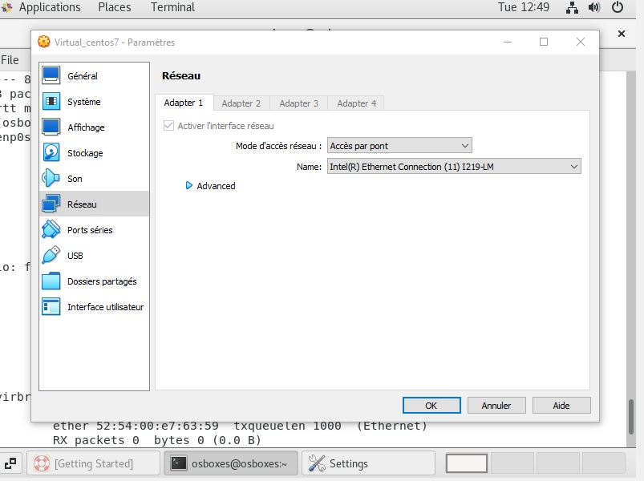

<br />
<div align="center">
  <h3 align="center">Install Virtualbox</h3>
  <p align="center">How to Install CentOS 7 on a Virtualbox using Pre-installed Image<br>
</div>

For those who may not know this, VirtualBox is a free, open source virtualization software that allows users to run multiple operating systems on their machine from within a single machine. In other words, you can spin up multiple virtual machines of any desired OS within minutes of each other as long as the underlining machine machine spec can handle the load.

### VirtualBox & Centos7
#### Download VirtualBox	
You can dowload VirtualBox from this link : https://download.virtualbox.org/virtualbox/7.0.4/VirtualBox-7.0.4-154605-Win.exe


#### Download Centos 7 Pre-installed Image
Download the latest Virtualbox VDI Image file from OSBoxes. Unzip the file using 7zip OR Winrar to a dedicated folder.<br>
You can download it from this repo http://www.osboxes.org/centos/<br>
Or you can directly dowload CentOS-7.9-2009 image from : https://deac-fra.dl.sourceforge.net/project/osboxes/v/vb/10-C-nt/7/7.9-2009/CentOS-7.9-2009_VB-64bit.7z

#### Download 7zip or Winrar
Download 7zip to exctract the image CentOS-7.9-2009_VB-64bit.7z : https://www.7-zip.org/a/7z2201-x64.exe<br> 
Download Winrar to exctract the image CentOS-7.9-2009_VB-64bit.7z : https://www.win-rar.com/fileadmin/winrar-versions/winrar/winrar-x64-611.exe<br>


Start your Virtualbox > Click on New and Enter details as follows<br>

    - Name: Enter name for your machine
    - Type: Select Linux
    - Version: Select Red Hat (64bit) or Red Hat (32bit) depending on the Image file version downloaded earlier


<br>
On Next, enter desired memory size (recommend 4096mb)<br>
On Next, select “Use an existing virtual hard disk file”. Click the small folder icon and navigate to the image file directory where you unzipped it to. Click Create<br>


<br>
Start the virtual machine > Ensure the first option as seen below is select


<br>
Next login with the password provided when you downloaded the image file. Its usually “osboxes.org”


<br>
On VirtualBox, go to Hardwares > Network > network Setting
Access Mod, chose "Bridg"


You should connect to local network in order to connect to Internet.
<br>
<br>
<br>
### Install Guest Additions On CentOS 7
You need to install the Guest Additions to allow you move your mouse freely between your VM and your physical desktop machine and also resize the VM desktop resolution<br>
Open your terminal and change to root user
```sh
    su -
    yum update kernel*
    reboot
```


Install following packages
```sh
    rpm -Uvh http://dl.fedoraproject.org/pub/epel/7/x86_64/e/epel-release-7-9.noarch.rpm
    yum install gcc kernel-devel kernel-headers dkms make bzip2 perl
```
